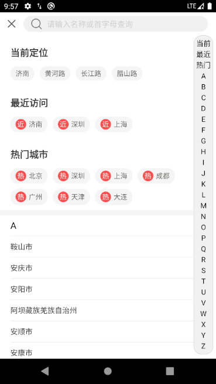

<p align="center">

</p>

# CityPicker-X ：城市选择/联系人列表

#### CityPicker-X 是一个可用于任何分组式列表+侧导航需求的开源框架

#### 如果您的需求无法实现或者您有更好的想法，非常欢迎您在issue中与我交流。我认为这是很重要的学习提升的过程

<br />

[](http://developer.android.com/index.html)
[](https://android-arsenal.com/api?level=23)
[  ](https://bintray.com/zhuxu820/Utils/CityPickerX/0.4.0/link)

<br />

>初衷是由于有“城市选择”需求，但手上没有很趁手的框架，就根据自己的需求半天时间写了一个，并且学习了git上其它优秀框架的经验(后面会列出)。
由于时间仓促，需求比较急，所以代码方面可能有些瑕疵，稍微空闲下来就会重新优化一下。
>
<br />

#### 主要目的

* 优化启动速度
* 搭建侧边导航栏与列表的沟通
* 添加自动首字母识别与自动排序(为提高效率目前需要手动调用)
* 快速设置头部布局
* 支持AndroidX

#### 未来打算
* 优化代码结构
* 优化启动方法
* 优化头部布局(已完成)
* 添加单独设置item icon功能
* 解决BUG

[点击下载demo(如无法下载请issue提交)](http://d.7short.com/citypickerx)

<p align="center">

</p>

#### 如何使用
```
<dependency>
	<groupId>com.utils.cocoz</groupId>
	<artifactId>citypickerx</artifactId>
	<version>0.4.0</version>
	<type>pom</type>
</dependency>
```
```
implementation 'com.utils.cocoz:citypickerx:0.4.0'
```
```
<dependency org="com.utils.cocoz" name="citypickerx" rev="0.4.0">
	<artifact name="citypickerx" ext="pom"></artifact>
</dependency>
```

#### 代码详解
##### 如何启动
```java
CityPickerXFragment cityPickerXFragment = CityPickerXFragment.startShow(MainTestActivity.this, getCityPickerConfig());
cityPickerXFragment.setPickerXInterface(new CommonPickerXInterface() {
                    @Override
                    public void onClick(CityBean cityBean) {
                        // 在此实现你的点击逻辑
                        Toast.makeText(getApplicationContext(), "you clicked " + cityBean.getName() + " , this is a " + cityBean.getType(), Toast.LENGTH_SHORT).show();
                    }

                    @Override
                    public void onDismiss() {
                        // 在此实现dismiss触发逻辑
                        Toast.makeText(getApplicationContext(), "dismiss", Toast.LENGTH_SHORT).show();
                    }

                    @Override
                    public void onSearch(String s) {
                        // 在此实现你的搜索逻辑
                        Toast.makeText(getApplicationContext(), "you search " + s, Toast.LENGTH_SHORT).show();
                    }

                    @Override
                    public void onReset() {
                        // 在此实现reset触发逻辑
                        Toast.makeText(getApplicationContext(), "reset", Toast.LENGTH_SHORT).show();
                    }
                });
```
##### 如何自定义头部模块
>共三个模块,每个模块都可以使用HeadModelConfig进行配置.
以下为示例代码，具体使用可查阅HeadModelConfig类中的备注

>通过CityPickerConfig进行整个框架的配置
通过HeadModelConfig进行头部布局配置
通过CityPickerXFragment.startShow(FragmentActivity activity, CityPickerConfig cityPickerConfig)应用

```java
// 生成头部配置类
HeadModelConfig locationConfig = new HeadModelConfig("当前定位", listLocation);
// setTag以用于更新数据
locationConfig.setTag("当前定位");
HeadModelConfig recentConfig = new HeadModelConfig("最近访问", listRecent, true, "近", 0, 0);
recentConfig.setTag("最近访问");
HeadModelConfig hotConfig = new HeadModelConfig("热门城市", listHot, true, "热", 0, 0);
hotConfig.setTag("热门城市");
// 生成配置类
CityPickerConfig cityPickerConfig = new CityPickerConfig(locationConfig, recentConfig, hotConfig, null);
return cityPickerConfig;
```
<br/>

#### 如何使用自定义列表
>默认会读取数据库文件中的城市列表
如需自定义列表,可使用CityPickerConfig.setListData(List<CityBean> listData)设置数据
注：如无需使用自定义列表，可直接setListData（null）即可

**建议您在设置列表之前(启动APP或获取城市列表后)使用CityDataInitUtils.initData进行初始化(识别首字母与排序)**

#### 如何更新数据
>使用以下方法:注意此处的tag与“自定义头部模块”部分的setTag为同一值
>cityPickerXFragment.updateData(String tag, List<CityBean> _listBeans);

#### 更多自定义
>CityBean与HeadModelConfig均支持自定义未使用拓展字段"tag"，或许您可以用得到

**如果您的需求无法实现或者您有更好的想法，非常欢迎您在issue中与我交流。我认为这是很重要的学习提升的过程**

#### 更新日志

##### 2020-7-25
* 优化事件接口,统一修改为PickerXInterface
* 新增onReset事件
* 分割sample与lib包
* 新增列表刷新方法
* 修复列表数据更新BUG
* 修复列表与侧导航栏字母不匹配的BUG
* 新增头部与侧导航栏关联

<br/>
<br/>

#### 参考的资料
[zaaach的CityPicker城市选择框架](https://github.com/zaaach/CityPicker "zaaach / CityPicker")
<br/>
[侧边分组导航栏](https://github.com/yuanshuaiding/LetterBar/tree/feffad117c4631badde220de0736b38f132493c0 "侧边分组导航栏")
<br/>
lichenwei.me的自定义分割线和组头实现(未找到原文链接)